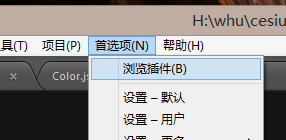
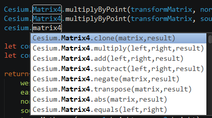

# sublime-cesium
sublime 的 cesium语法提示插件

# 使用方法
1. 下载文件
~~~
git clone https://github.com/Fav/sublime-cesium.git
~~~
2. 将文件夹复制到 Sublime的package 路径下  

3. 使用  

## 重新生成
如果需要重新生成提示配置文件,需要安装依赖包，重新编译
1. 安装npm,[Nodejs官网](https://nodejs.org/en/)
2. 执行安装命令
~~~
npm install
~~~
3. 执行生成命令
~~~
node index.js
~~~
